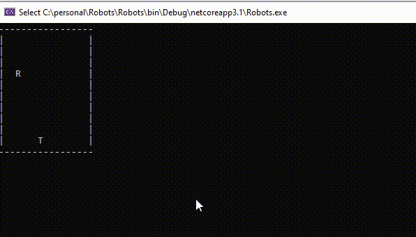

# Robot Challenge

## Part 1

+ You are given a grid containing a robot and some treasure.
+ The robot can see one cell in any direction (up, down, left, right)
+ The robot can move one cell at a time.
+ Move the robot onto the treasure

## Part 2

+ Try and take the shortest path.

### My solution

